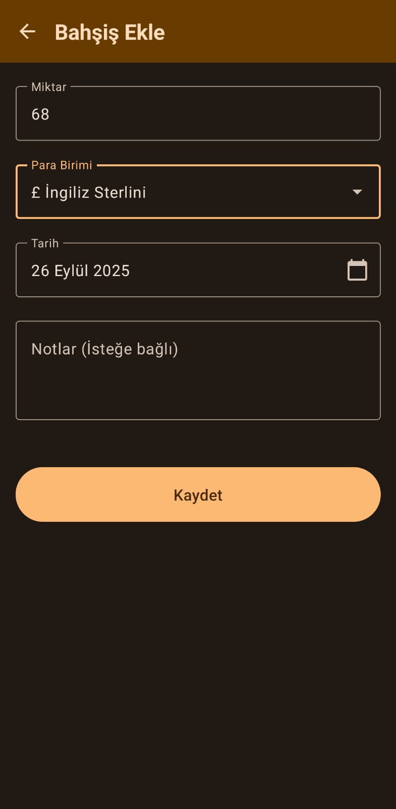
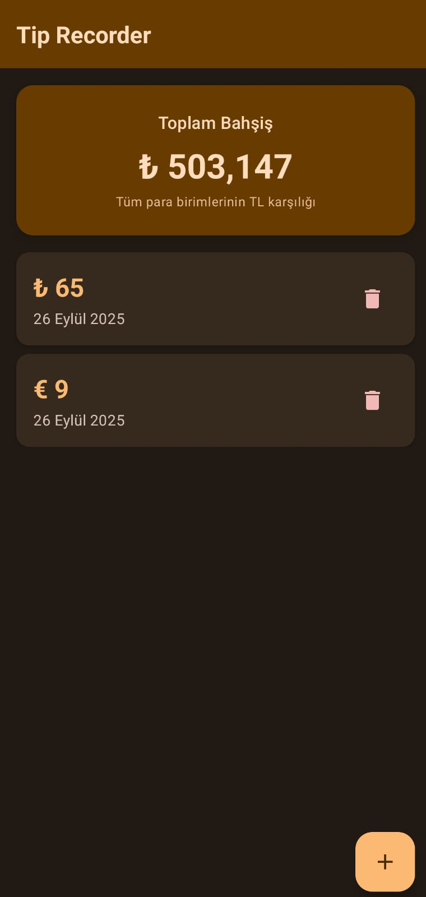
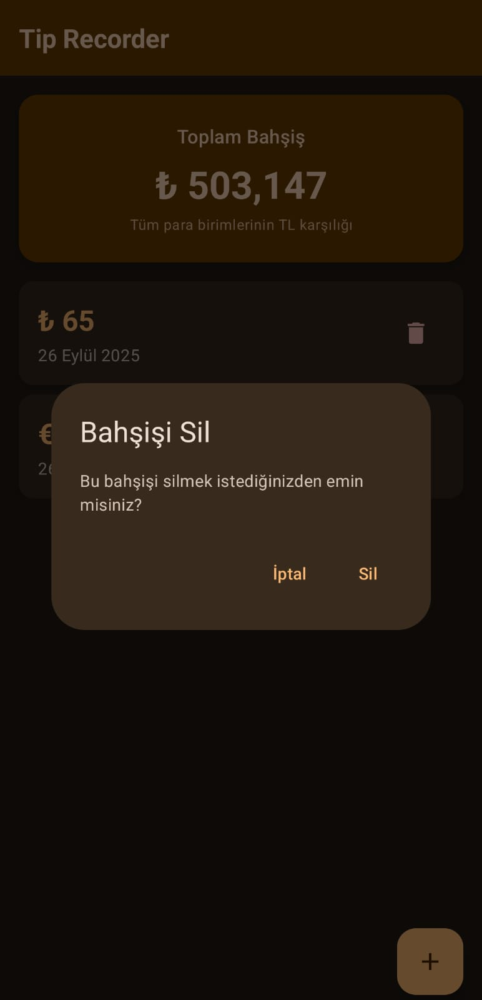

# Tip Recorder 💰

A modern Android app for tracking tips with multi-currency support and automatic TRY conversion.

## Features ✨

- **Multi-Currency Support**: Track tips in 20+ different currencies (USD, EUR, GBP, JPY, etc.)
- **Automatic Currency Conversion**: All tips are automatically converted to Turkish Lira (TRY) for total calculation
- **Modern UI**: Beautiful Material Design 3 interface with Jetpack Compose
- **Local Storage**: Secure local database using Room
- **Date Tracking**: Record tips with specific dates
- **Notes Support**: Add optional notes to your tips
- **Delete Functionality**: Remove tips with confirmation dialog
- **Real-time Updates**: Live total calculation as you add tips

## Screenshots 📱

<div align="center">
  
  
  
</div>

The app features:
- **Home Screen**: Shows total tips in TRY equivalent and list of all tips
- **Add Tip Screen**: Add new tips with amount, currency, date, and notes
- **Card-based Design**: Clean and modern card layout for tip entries

## Technical Stack 🛠️

- **Language**: Kotlin
- **UI Framework**: Jetpack Compose
- **Architecture**: MVVM (Model-View-ViewModel)
- **Database**: Room (SQLite)
- **Dependency Injection**: Hilt
- **Navigation**: Navigation Compose
- **State Management**: StateFlow
- **Currency Conversion**: Custom CurrencyConverter with real-time exchange rates


## Currency Support 💱

The app supports automatic conversion for:
- Turkish Lira (TRY) - Base currency
- US Dollar (USD)
- Euro (EUR)
- British Pound (GBP)
- Japanese Yen (JPY)
- Canadian Dollar (CAD)
- Australian Dollar (AUD)
- Swiss Franc (CHF)
- Chinese Yuan (CNY)
- Swedish Krona (SEK)
- Norwegian Krone (NOK)
- Danish Krone (DKK)
- Polish Zloty (PLN)
- Russian Ruble (RUB)
- Indian Rupee (INR)
- Brazilian Real (BRL)
- South Korean Won (KRW)
- Mexican Peso (MXN)
- Singapore Dollar (SGD)
- Hong Kong Dollar (HKD)

## Installation 📦

1. Clone the repository:
```bash
git clone https://github.com/yourusername/tip-recorder.git
```

2. Open the project in Android Studio

3. Sync the project with Gradle files

4. Run the app on your device or emulator

## Requirements 📋

- Android Studio Arctic Fox or later
- Android SDK 24 (Android 7.0) or higher
- Kotlin 1.9.20+
- Gradle 8.5+

## Usage 🚀

1. **Add Tips**: Tap the "+" button to add a new tip
2. **Select Currency**: Choose from 20+ supported currencies
3. **Enter Amount**: Input the tip amount
4. **Set Date**: Use the date picker to select the date
5. **Add Notes**: Optionally add notes to your tip
6. **View Total**: See the total amount converted to TRY on the home screen
7. **Delete Tips**: Long press or use the delete button to remove tips

## Contributing 🤝

Contributions are welcome! Please feel free to submit a Pull Request.

## License 📄

This project is licensed under the MIT License - see the [LICENSE](LICENSE) file for details.

## Acknowledgments 🙏

- Material Design 3 for the beautiful UI components
- Jetpack Compose team for the modern UI framework
- Android Architecture Components for the robust architecture

---


